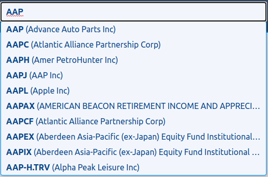
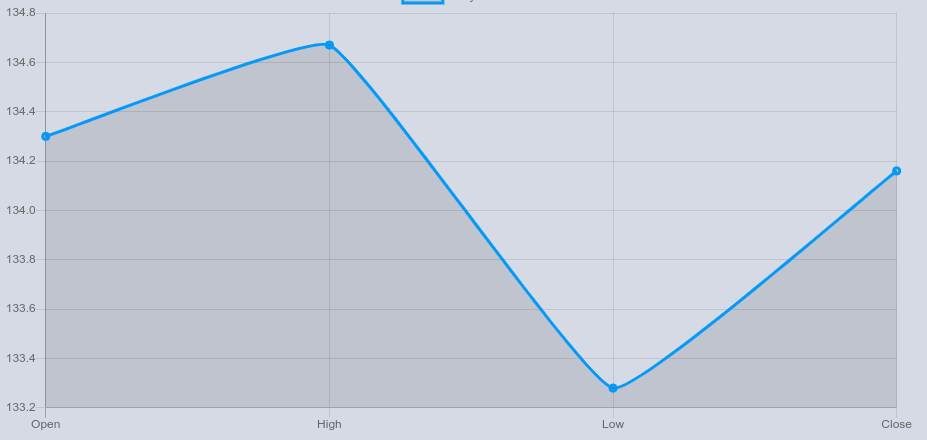
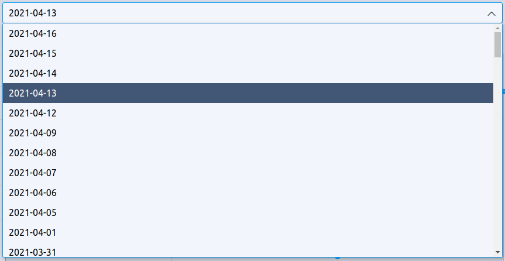
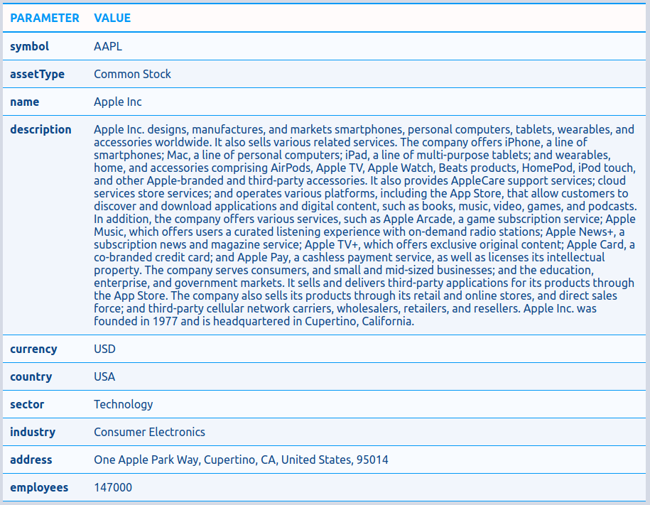
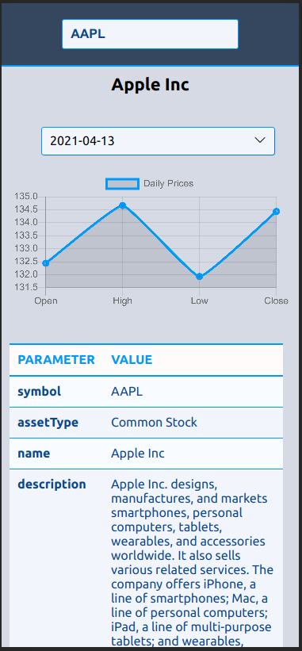
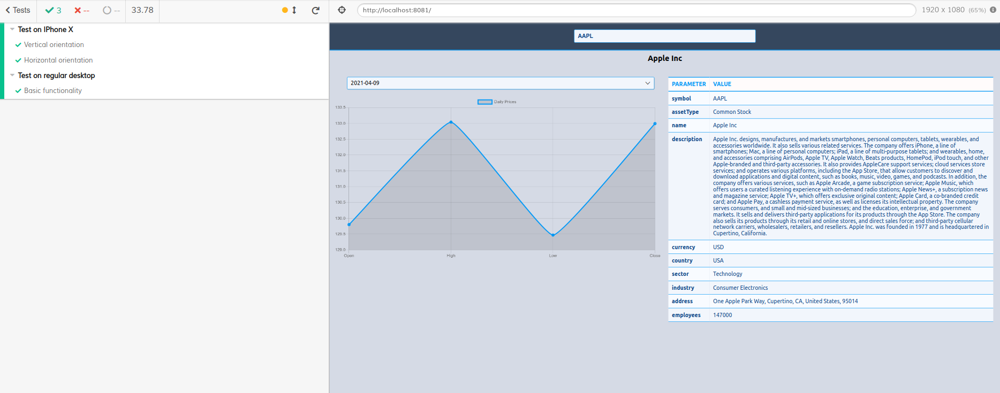

## Stock Service POC

On this page:

* <a href="#introduction">Introduction</a>
* <a href="#how-to-work-with-ui">How to work with UI</a>
* <a href="#configure-applicationyml">Configure application.yml</a>
* <a href="#how-to-run-stock-service">How to run Stock Service</a>
    * <a href="#swagger-ui">Swagger UI</a>
    * <a href="#ui-part">UI Part</a>
* <a href="#api-endpoints">API Endpoints</a>
* <a href="#dockerpodman">Docker/Podmaan</a>
* <a href="#implementation-tasks-and-log-work">Implementation tasks and log work</a>

## Introduction

This is a custom stock service for receiving a daily stock quotes and company data from the [AlphaVantage](https://www.alphavantage.co/). **Stock service** project contains 2 parts: server side and front end for visualization company's stock data. Server side is a Java application based on Spring Boot 2.4.4 ecosystem and implement a proxy service for the connection to the external API. 

This service aggregates a data fot the front-end application as one response per company. 

## How to work with UI

For visualization data we need to choice an interesting us company. Each company has own unique stock symbol and user might not be able to remember all symbols. For helping to choice a proper company **Stock Service** offer to search the company by some keywords:




After the company was choose user have the ability to see the last daily company's stocks.



After the first loading company'S data the latest respective daily stock quotes are draw by chart component. At the same time user has always the possibility to choosing the previous dates stock quotes:




In second part of the screen user have the ability to see overall basic information about the company.  



Layout of the front end part is fully responsive and implemented as a mobile-friendly web application.



## Configure application.yml

Below section describes how to configure application.yml file to override the default values.

Spring Boot Application name:

```ỳaml
  spring:
    application:
        name: api
```

Spring Boot Server Port: 

```ỳaml
  server:
    port: 3000
```

Spring Boot Application Context path:

```ỳaml
server:
    servlet:
        contextPath: /
```

Spring Boot Application Logging level:

```ỳaml
logging:
    level:
        root: INFO
```

Stock Service Application properties:

```ỳaml
application:
    version: 1.0.0
    alpha-vantage-api: https://www.alphavantage.co/
    key: S9I96OJM9FVJE5NB
```

Open API Configuration Properties:

```ỳaml
application:
    swagger:
        base-package: org.alphavantage.api.web.rest
        title: ALPHA VANTAGE REST API Services
        description: The services which are expose API for the ALPHA VANTAGE services
        version: 1.1
        terms-of-service-url: Terms of service
        contact-name: Taras Chornyi
        contact-url: https://github.com/reftch
        contact-email: taras.chornyi@gmail.com
        license: Apache License Version 2.0
        license-url: https://www.apache.org/licenses/LICENSE-2.0
```


## How to run Stock Service

The server side part is build by Gradle Build tool. For running integration tests just perform following command:

    ./gradlew clean build

This service has ability to be started with a single Gradle command:

    ./gradlew bootRun


### Swagger UI

This service also has the ability to get access for service from the Swagger UI console:

[**http://localhost:3000/swagger-ui.html**](http://localhost:3000/swagger-ui.html)

### UI part

UI part is based on the VueJS 3 with supporting Typescript. [Axios](https://github.com/axios/axios) library is used as a Http client of the server side and [Chart.js](https://www.chartjs.org/) for representing the company daily quote stocks. 

For running client part we need import all necessary dependencies and then run the client in the development mode:

1. npm install
2. npm run serve

After starting procedure **Service Stock** application will be accessible here: [http://localhost:8081](http://localhost:8081)

Front end application has also unit tests based on [Jest](https://jestjs.io/) testing framework. [Cypress](https://www.cypress.io/) a next generation front end testing tool built for the modern web and uses in this project as end to end testing. 

1. Unit testing: npm run test:unit 
2. E2E testing: npm run test:e2e

Integration tests by default will run in the headless mode and uses Electron 78 as a text browser. You can verify the code has worked by opening the Cypress GUI and running a test in headful mode. The browser window should now open with developer tools prominently displayed. In E2E tests the application run in so called *'test'* mode, it means that uses mock http client instead of Axios and all data loads from the local files.  



## API Endpoints

1. General company information. Example: *http://localhost:3000/api/v1/company?symbol=AAPL*
2. Daily stock quotes. Example: *http://localhost:3000/api/v1/prices?symbol=AAPL*
3. Search endpoint. Example: *http://localhost:3000/api/v1/search?keywords=AA*

## Docker/Podman
  
Server side (api):
1. cd api
2. **podman** build --build-arg JAR_FILE=app/build/libs/\*.jar -t stock-api:dev .
3. **podman** run -p 3000:3000 --name stock-api stock-api:dev

Front end (UI):
1. cd ui
2. **podman** build -t stock-ui:dev . 
3. **podman** run -it -p 9000:80 --rm --name stock-ui stock-ui:dev 

After creating a local containers as an images, we have the possibility to run **Stock Service** as a Kubernetes pod. Kubernetes YAML file:

**podman** play kube ./stock-service.yaml

After starting pod the **Service Stock** application will be accessible here: [http://localhost:9000](http://localhost:9000)

## Implementation tasks and log work

Task                              | Date                  | Time   
:-----                              | :----               | :-----          
Java API service Implementation   |  14.04.2021         |   **6h**
UI skeleton. Implementation of the autocompletion input field  | 15.04.2021  |  **4h**
Added charts, dropdown component, added responsive layout    |   16.04.2021 | **6h**
Added company info endpoint on backend, added table  |  17.04.2021 |  **4h**
Added unit and e2e tests. Added containers, pod.     |  18.04.2021  | **3h**  
Adjusted project documentation    | 18.04.2021          |   **2h**

Total time: **25h (~4d)**.
